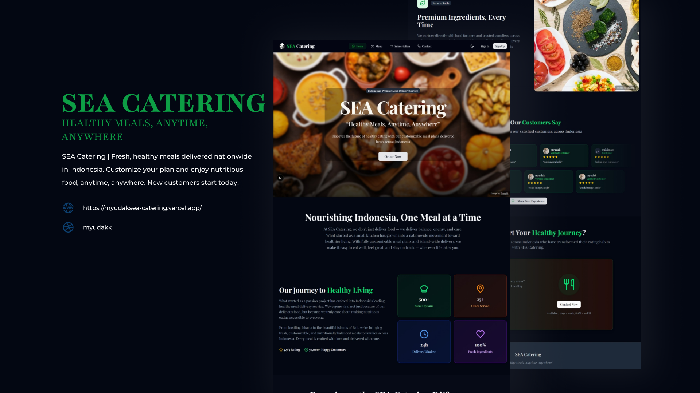
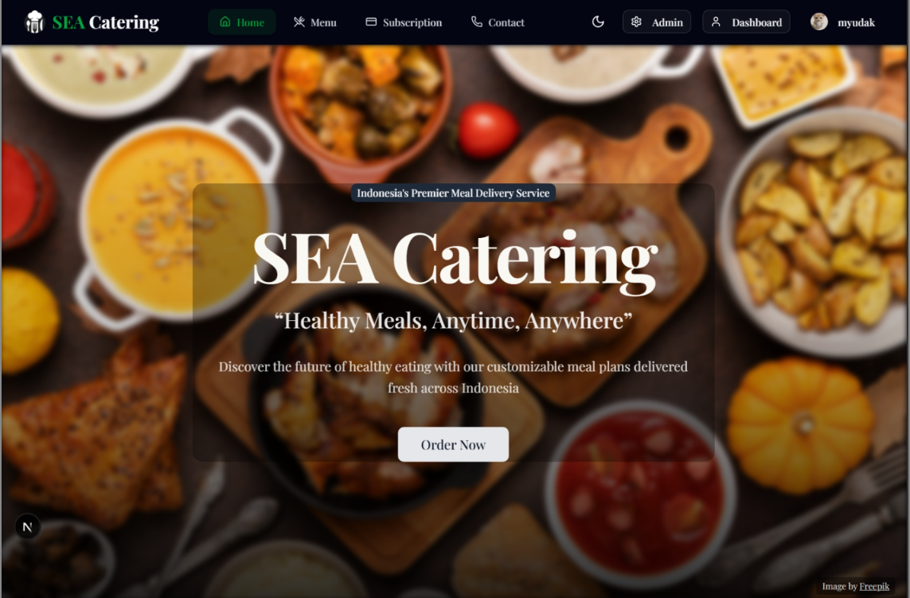
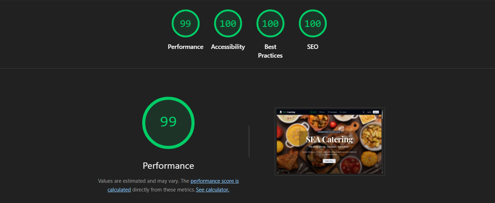
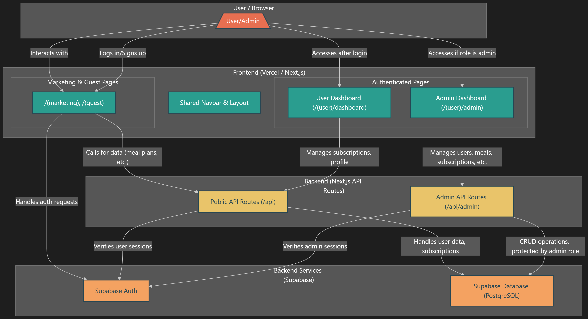

# 🍽️ SEA-Catering

<div align="center">
  
  **A modern subscription-based meal delivery service**
  
  [](https://myudaksea-catering.vercel.app/)
  [](https://www.github.com/myudak)
  [](https://github.com/myudak/SEA-catering/releases)
  [](https://github.com/myudak/SEA-catering/commits/main)
  [](https://myudaksea-catering.vercel.app/)
  [](#copyright)

[🚀 Live Demo](https://myudaksea-catering.vercel.app/) • [⬇️ Installation](#-quick-start) • [🤝 Contributing](#-contributing) • [📞 Contact](#-contact)

</div>

---

## 🗄️ Database Schema

The application uses Supabase (PostgreSQL) with the following main tables:

### Core Tables

- **`profiles`** - User profiles with role-based access (user/admin)
- **`meal_plans`** - Available meal subscription plans
- **`subscriptions`** - User subscription records and status
- **`testimonials`** - User feedback and reviews
- **`promo_codes`** - Discount codes and campaign management

### Key Features

- **Row Level Security (RLS)** - Implemented for data protection
- **Real-time Subscriptions** - Live updates using Supabase Realtime
- **Authentication Integration** - Seamless with Supabase Auth
- **Optimized Queries** - Indexed for performance

> 📋 **Schema File**: Complete database schema is available in `./supabase/schema.sql`

### Database Setup Options

<details>
<summary>🔧 Manual Setup Instructions</summary>

If you prefer to set up the database manually:

1. **Create Tables**: Run each table creation statement from `schema.sql`
2. **Set Up RLS**: Enable Row Level Security policies
3. **Create Indexes**: Add performance indexes for frequently queried columns
4. **Insert Sample Data**: Optional starter data for testing

</details>

---

## 📸 Preview

<div align="center">
  
  [](https://myudaksea-catering.vercel.app/)
  
  *Click the image above to visit the live application*

| Role         | Email             | Password     |
| ------------ | ----------------- | ------------ |
| **👨‍💼 Admin** | `admin@admin.com` | `Admin1234@` |
| **👤 User**  | `user@demo.com`   | `User1234@`  |

> 🚀 **Quick Start**: Use the admin credentials to explore the full dashboard functionality!

</div>

<details>
<summary>📱 More Screenshots</summary>




</details>

---

## 🌟 About The Project

SEA-Catering is a full-stack subscription-based meal delivery service that revolutionizes how customers experience food delivery. Built with modern web technologies, it provides a seamless experience for users to discover, subscribe to, and manage their meal plans while offering administrators powerful tools to manage the entire platform.

### 🎯 Key Highlights

- **Modern Architecture**: Built with Next.js 14+ and App Router
- **Real-time Updates**: Powered by Supabase for instant data synchronization
- **Performance Optimized**: Features ISR (Incremental Static Regeneration) and SSR
- **Admin-Friendly**: Comprehensive dashboard for complete platform management
- **Mobile-First**: Responsive design that works perfectly on all devices

---

## ✨ Features

### 👥 User Features

- 🔐 **Secure Authentication** - Sign up/sign in with Supabase Auth
- 🍕 **Meal Plan Browser** - Explore diverse meal options with detailed descriptions
- 📋 **Subscription Management** - Easy subscription control from user dashboard
- 💬 **Testimonial System** - Share experiences and read community feedback
- 🎟️ **Promo Code Support** - Apply discount codes for better deals
- 📱 **Responsive Experience** - Seamless across desktop, tablet, and mobile

### 🛠️ Admin Features

- 👨‍💼 **User Management** - Complete user oversight and management
- 🍽️ **Meal Plan Control** - Add, edit, and organize meal offerings
- 📊 **Subscription Analytics** - Monitor and manage all user subscriptions
- ✅ **Content Moderation** - Approve/reject user testimonials
- 🎫 **Promo Code Management** - Create and manage discount campaigns
- 📈 **Dashboard Analytics** - Comprehensive business insights

### 🚀 Technical Features

- ⚡ **ISR Implementation** - Incremental Static Regeneration for optimal performance
- 🖥️ **SSR Support** - Server-side rendering for better SEO and loading times
- 🔄 **Real-time Updates** - Live data synchronization across all users
- 🎨 **Modern UI/UX** - Clean, intuitive interface built with Shadcn UI

---

## 🛠️ Tech Stack

<div align="center">

| Category       | Technology                                                                                                                                                                                                          |
| -------------- | ------------------------------------------------------------------------------------------------------------------------------------------------------------------------------------------------------------------- |
| **Frontend**   |              |
| **Styling**    |   |
| **Backend**    |                                                                                                                   |
| **Deployment** |                                                                                                                         |

</div>

---

## ⚡ Quick Start

### Prerequisites

Before you begin, ensure you have the following installed:

- **Node.js** (v20 or later) - [Download here](https://nodejs.org/en/)
- **pnpm** - [Installation guide](https://pnpm.io/installation)
- **Git** - [Download here](https://git-scm.com/)

### Installation

1. **Clone the repository**

   ```bash
   git clone https://github.com/myudak/SEA-catering.git
   cd SEA-catering
   ```

2. **Install dependencies**

   ```bash
   pnpm install
   ```

3. **Set up Supabase Project**

   - Create a new project at [Supabase](https://app.supabase.com/)
   - Copy your project URL and anon key from **Project Settings > API**

4. **Configure environment variables**

   Create a `.env.local` file in the root directory:

   ```env
   NEXT_PUBLIC_SUPABASE_URL=your_supabase_project_url
   NEXT_PUBLIC_SUPABASE_ANON_KEY=your_supabase_anon_key
   ```

   > 💡 **Tip**: Never commit your `.env.local` file to version control

5. **Initialize the database schema**

   **Option A: Using Supabase CLI**

   ```bash
   # Install Supabase CLI if you haven't already
   npm install -g supabase


   # Link your project
   supabase link --project-ref <your project ref>


   # Run the schema
   supabase db push
   ```

   **Option B: Using Supabase Web UI (Recommended)**

   1. Go to [Supabase Dashboard](https://app.supabase.com/)
   2. Select your project
   3. Navigate to **SQL Editor** in the left sidebar
   4. Click **"New Query"**
   5. Copy and paste the contents from `./supabase/schema.sql`
   6. Click **"Run"** to execute the schema

   > 💡 **Tip:** Also remember to disable email confirmation in Supabase:  
   > Go to **Supabase → Auth → Sign-in Providers → Email → Disable "Confirm Email"**

6. **Run the development server**

   ```bash
   pnpm dev
   ```

7. **Open your browser**

   Navigate to [http://localhost:3000](http://localhost:3000) to see the application running! 🎉

---

## 👨‍💼 Admin Setup

To create an admin user:

1. **Sign up** for a new account through the application
2. **Access Supabase Dashboard** → Navigate to your project
3. **Open Table Editor** → Select the `profiles` table
4. **Update User Role** → Change `role` from `user` to `admin`
5. **Access Admin Panel** → Visit `/admin` with your admin account

> ⚠️ **Security Note**: Only grant admin access to trusted users as they will have full platform control.

---

## 📁 Project Structure

```
SEA-Catering/
├── 📂 src/
│   ├── 📂 app/                    # Next.js App Router
│   │   ├── 📂 (guest)/           # Unauthenticated routes
│   │   ├── 📂 (marketing)/       # Landing & marketing pages
│   │   ├── 📂 (user)/            # Authenticated user routes
│   │   └── 📂 api/               # API routes & server logic
│   ├── 📂 components/            # Reusable UI components
│   ├── 📂 lib/                   # Utilities & configurations
│   └── 📂 types/                 # TypeScript definitions
├── 📂 supabase/                  # Database schemas & migrations
├── 📂 docs/                      # Documentation & assets
└── 📂 public/                    # Static assets
```

### Architecture Overview

<div align="center">
  
  
  
  *Application architecture showing the flow between frontend, backend, and database*

</div>

---

## 🚀 Deployment

### Vercel Deployment (Recommended)

The application is optimized for deployment on **Vercel**:

1. **Connect Repository**

   - Link your GitHub repository to Vercel
   - Import the project to your Vercel dashboard

2. **Configure Environment Variables**

   ```
   NEXT_PUBLIC_SUPABASE_URL=your_supabase_project_url
   NEXT_PUBLIC_SUPABASE_ANON_KEY=your_supabase_anon_key
   ```

3. **Deploy**
   - Vercel will automatically build and deploy your application
   - Your app will be live within minutes!

[](https://vercel.com/new/clone?repository-url=https://github.com/myudak/SEA-catering)

### Alternative Deployment Options

<details>
<summary>🐳 Docker Deployment</summary>

```dockerfile
# Example Dockerfile structure
FROM node:20-alpine
WORKDIR /app
COPY package*.json ./
RUN npm install
COPY . .
RUN npm run build
EXPOSE 3000
CMD ["npm", "start"]
```

</details>

<details>
<summary>☁️ Other Platforms</summary>

- **Netlify**: Configure build settings for Next.js
- **Railway**: One-click deployment with automatic SSL
- **DigitalOcean App Platform**: Scalable container deployment
- **AWS Amplify**: Full-stack deployment with CI/CD

</details>

### Post-Deployment Checklist

- ✅ Verify environment variables are set correctly
- ✅ Test database connection and schema
- ✅ Create your first admin user
- ✅ Test core functionality (auth, subscriptions, admin panel)
- ✅ Set up domain and SSL (if using custom domain)

---

## 🤝 Contributing

We welcome contributions from the community! Here's how you can help:

### Ways to Contribute

- 🐛 **Report bugs** by opening an issue
- 💡 **Suggest features** or improvements
- 📝 **Improve documentation**
- 🔧 **Submit pull requests**

### Development Workflow

1. **Fork** the repository
2. **Create** a feature branch: `git checkout -b feature/amazing-feature`
3. **Commit** your changes: `git commit -m 'Add amazing feature'`
4. **Push** to the branch: `git push origin feature/amazing-feature`
5. **Open** a Pull Request

### Code Style

- Follow the existing code style and conventions
- Write clear, descriptive commit messages
- Add tests for new features when applicable
- Update documentation as needed

---

## 📞 Contact

<div align="center">

**Maintainer**: [@myudak](https://github.com/myudak)

[](https://myudak.com)
[](https://github.com/myudak)
[](mailto:yudaplzhacker@gmail.com)

</div>

---

<div align="center">

**⭐ Star this repository if you found it helpful!**

[](https://github.com/myudak/SEA-catering/stargazers)
[](https://github.com/myudak/SEA-catering/network/members)

Made with ❤️ by [myudak](https://github.com/myudak)

</div>
